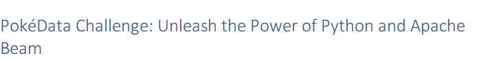

# Foobar



## Installation

Clone the repository locally and run the following command(s):
1. cd into the repository
2. Spin up a virtual environment
```bash
pip install virtualenv
python -m venv env
```
3. Activate the virtual environment
```bash
source env/bin/activate (on Windows)
env/Scripts/activate.bat (in CMD)
env/Scripts/Activate.ps1 (in Powershell)
```
4. Install project dependencies
```bash
pip install -r requirements.txt
```
Use the package manager [pip](https://pip.pypa.io/en/stable/) to install required
dependencies.

## License

[MIT](https://choosealicense.com/licenses/mit/)